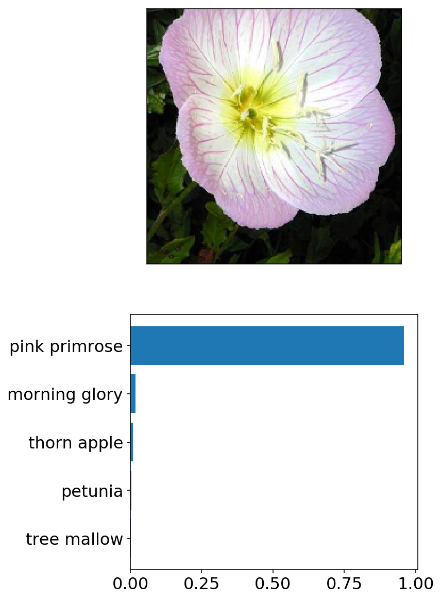

# Flower classification

This project uses convolutional neural network to train an image classifier that is able to identify 102 different flower species with 93% testing accuracy. This image classifier can be used to identify flower species from new images, e.g., in a phone app that tells you the name of the flower your camera is looking at.

## 1. Problem to solve

Build an application to tell the name of flower from an image.

## 2. Available data

[102 Category Flower Dataset](http://www.robots.ox.ac.uk/~vgg/data/flowers/102/index.html) was given by the Nanodegree program. This dataset contains images of 102 different flower species with lables. These images have different sizes.

Data file structure:

- `flowers`: folder of image data.
    - `train`, `valid`, `test`: subfolders for training, validating, and testing the image classifier, respectively.
        - `1`, `2`, ..., `102`: 102 subfolders whose names indicate different flower categories. Given the large data size, data folders are not included here.

## 3. What I did

[Main Code](Image_Classifier_Project.ipynb)

1. Data loading and data preprocessing

    - Load image data
    - Training set: apply transformations such as rotation, scaling, and horizontal flipping (model generalizes / performs better)
    - All datasets: Resize and crop to the appropriate image size (required by pre-trained model)
    - All datasets: Normalize image colors (RGB) using mean and standard deviation of pre-trained model
    - Training set: data shuffled at each epoch

2. Build and train the model

    - Load a pre-trained network `densenet121` ([reference](https://arxiv.org/pdf/1608.06993.pdf)) and freeze parameters
    - Define a new, untrained neural network as a classifier. The classifier has a hidden layer (ReLU activation) and an output layer (LogSoftmax activation). Assign dropout to reduce overfitting.
    - Assign criterion (NLLLoss, negative log loss) and optimizer (Adam, adaptive moment estimation, [reference](https://arxiv.org/abs/1412.6980))
    - Train the classifier layers using forward and backpropagation on GPU
    - Track the loss and accuracy on the validation set to determine the best hyperparameters

3. Use the trained classifier to predict image content

    - Test trained model on testing set (93% accuracy)
    - Save trained model as checkpoint
    - Write a function that gives top-5 most probable flower names based on image path

4. Build a command line application

    - See below for details

## 4. How to run the command line application

- #### Train the image classifier

    [`train.py`](train.py): Train the image classifier, report validation accuracy along training, and save the trained model as a checkpoint.

    - Basic usage:
        - Specify directory of image data: `python train.py flowers`

    - Options:
        - Set directory to save checkpoints: `python train.py flowers --save_dir assets`
        - Choose architecture: `python train.py flowers --arch "vgg13"`
        - Set hyperparameters: `python train.py flowers --learning_rate 0.001 --hidden_units 512 --epochs 20`
        - Use GPU for training: `python train.py flowers --gpu`

- #### Identify flower name from a new image

    [`predict.py`](predict.py): Use the trained image classifier to predict flower name along with the probability of that name

    - Basic usage: 
        - Specify file path of the image and directory name of saved checkpoint: `python predict.py flowers/test/1/image_06743.jpg assets`

    - Options:
        - Return top K most likely classes: `python predict.py flowers/test/1/image_06743.jpg assets --top_k 3`
        - Use a mapping of categories to real names: `python predict.py flowers/test/1/image_06743.jpg assets --category_names cat_to_name.json`
        - Use GPU for inference: `python predict.py flowers/test/1/image_06743.jpg assets --gpu`
